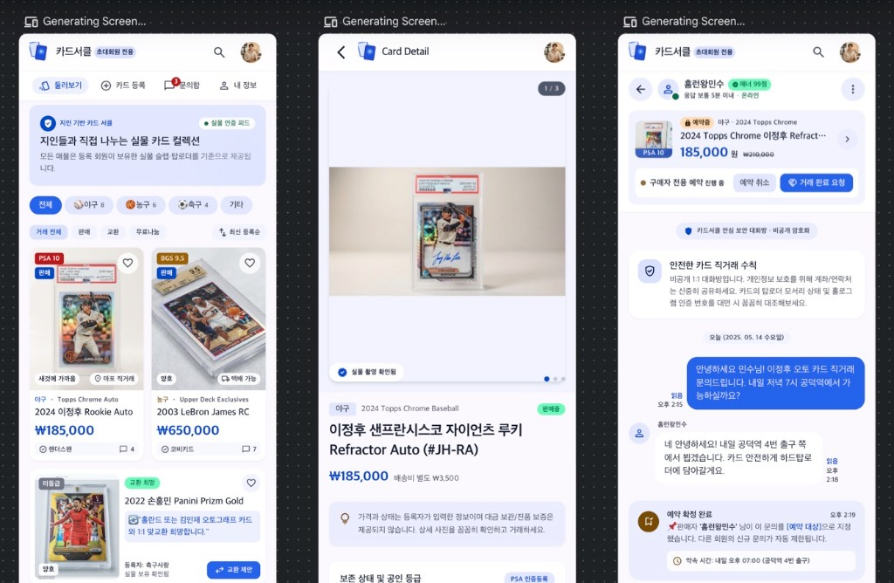

# 카드서클 데모

지인 기반 카드 거래 커뮤니티의 화면 데모입니다. 매물 둘러보기, 카드 등록, 관심 저장, 비공개 문의, 예약과 완료를 이 브라우저의 `localStorage`에 저장합니다.

기술 명세는 `xref/D06 SPEC Card_Circle_Community_SPEC_v1.0.md`, 화면 기준은 `xui`의 스티치 시안입니다. 상단의 이미지는 그 시안(둘러보기, 카드 상세, 문의)입니다.

## 이번 작업

- React, Vite, TypeScript, Tailwind CSS로 모바일 화면을 구성했습니다.
- 하단 메뉴는 둘러보기, 가운데 카드 등록, 문의함, 내 정보입니다.
- 첫 실행 시 데모 회원 5명, 매물 20개(야구 8, 농구 6, 축구 4, 기타 2), 문의 6개, 거래 3개를 넣습니다. 사진은 앱 안에서 만든 플레이스홀더이고 가격은 가상 값입니다.
- 종목, 판매·교환·나눔, 진행·예약·완료, 검색, 최신·가격 정렬로 매물을 거릅니다.
- 카드 등록은 사진, 카드 정보, 상태, 거래 조건, 미리보기 순서로 진행하고 필수값 오류를 보여 줍니다.
- 문의는 매물과 구매자 조합당 하나이고, 같은 전송 식별자는 메시지로 한 번만 저장합니다.
- 등록자만 예약과 완료 요청을 할 수 있고, 지정된 상대만 완료를 확인하거나 이의를 제기할 수 있습니다. 한 매물의 진행 중 거래는 하나입니다.
- **지금 보는 사람**으로 데모 회원을 바꿔 한 브라우저에서 양쪽 흐름을 시연합니다. 운영 로그인 화면은 아닙니다.
- 가격과 상태는 등록자 입력입니다. 완료 표시는 대금 지급이나 진품 확인이 아닙니다.

## 시안에서 고친 내용

스티치 시안과 기술 명세가 어긋나는 부분은 명세를 기준으로 고쳤습니다.

- 실물 인증, 매너 점수, 실물 촬영 확인됨, PSA 인증등록, 신뢰 등록, 안전 거래, 바로 구매 문구는 넣지 않았습니다. 상세에는 가격과 상태가 등록자 입력이라는 안내를 둡니다.
- 등급과 인증번호는 등록자가 적은 값으로만 보여 줍니다.
- 가격은 `₩185,000` 형식으로 통일했습니다. 시안의 취소선 가격이나 `185,000원` 표기는 쓰지 않습니다.
- 하단 메뉴는 시안 HTML과 같이 네 곳입니다. 디자인 문서의 다섯 탭(홈, 탐색, 등록, 채팅, 마이)은 따르지 않습니다.
- 사진 칸 버튼 이름이 앞면처럼 두 번 읽히던 것을 `앞면 사진 선택`으로 고쳤습니다.
- 판매 철회, 외부 거래 완료, 데모 데이터 초기화는 확인을 누른 뒤에만 실행됩니다.
- 예약 중이거나 완료된 매물에는 새 문의를 시작하지 않고, 완료·철회 뒤에는 새 메시지를 보내지 않습니다. 기존 대화는 볼 수 있습니다.
- 상세와 등록 화면의 제목 줄이 데모 배너에 가리지 않도록 배너 높이에 맞춰 붙입니다.

## 실행

```bash
npm install
npm run dev
```

다른 명령:

- `npm run typecheck`
- `npm test`
- `npm run build`

테스트는 판매·교환·나눔 가격 규칙, 예약 충돌, 완료 확인 권한, 메시지 중복 방지를 검사합니다.

## 시연

1. `홈런왕민수`로 판매 중 카드를 열고 문의합니다.
2. 등록자로 바꿔 그 문의를 예약으로 지정합니다.
3. 완료를 요청한 뒤, 다시 문의자로 바꿔 완료를 확인합니다.

내 정보에서 데모 데이터를 처음 시드로 되돌릴 수 있습니다. 360px 너비에서 페이지가 가로로 넘치지 않는지 확인했습니다.

## 이 데모에 없는 것

초대 가입, 세션, Neon, 비공개 사진 저장소, 운영자 화면, 게시판, 거래 후기, 앱 내 알림, 결제, 배송은 구현하지 않았습니다. 신고는 이 브라우저에만 기록됩니다.
